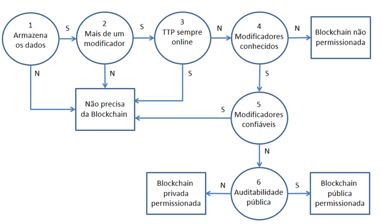
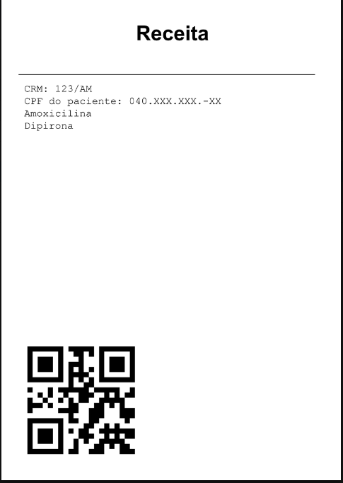

# 💊 Blockchain de Prescrições

Sistema de **emissão e validação de receitas médicas** usando uma blockchain própria (implementada em Python), com uma camada de **smart contract** que valida médicos, pacientes e farmácias antes de qualquer bloco ser minerado.

> ⚠️ Este **não** é um sistema de armazenamento de receitas. As transações de emissão guardam apenas um **link** para o PDF da receita, que fica armazenado em outro sistema (neste projeto, o Google Drive).

---

## Sumário

- [Problema e solução](#problema-e-solução)
- [É necessário usar blockchain?](#é-necessário-usar-blockchain)
- [Arquitetura](#arquitetura)
- [Camadas: blockchain vs. smart contract](#camadas-blockchain-vs-smart-contract)
   - [Arquitetura do smart contract](#arquitetura-do-smart-contract)
- [Estrutura do projeto](#estrutura-do-projeto)
- [Instalação](#instalação)
- [Configuração do Google Drive](#configuração-do-google-drive)
- [Como usar](#como-usar)
  - [Interface web (Streamlit)](#interface-web-streamlit)
- [Exemplo de receita gerada](#exemplo-de-receita-gerada)
- [Validações de documentos](#validações-de-documentos)
- [Regras do smart contract](#regras-do-smart-contract)


---

## Problema e solução

O principal problema que este sistema combate é a **falsificação de receitas médicas**:

- Receitas podem ser forjadas.
- Receitas legítimas podem ser copiadas e reutilizadas.

O sistema ataca esses dois pontos da seguinte forma:

- A farmácia **não consegue validar** uma receita que não foi emitida na blockchain.
- Uma receita legítima que já foi validada por uma farmácia (ou rede de farmácias) **não pode ser validada novamente** por outra.

Como bônus, o paciente ganha conveniência: a receita não precisa ser impressa para ser validada, basta apresentá-la (ou o seu QR Code) no celular.

## É necessário usar blockchain?

Para justificar o uso de blockchain, o projeto segue o fluxograma de decisão proposto por **Wüst e Gervais (2017)** no artigo [*Do you need a Blockchain?*](https://eprint.iacr.org/2017/375.pdf).




Respondendo às perguntas do fluxograma:

| Pergunta | Resposta neste projeto |
|---|---|
| Armazena dados? | Sim — dados da receita, médico emissor e farmácia validadora. |
| Mais de um modificador? | Sim — centenas de milhares de médicos e farmácias no Brasil. |
| Existe uma TTP (terceiro confiável) sempre online? | Existem TTPs confiáveis na *procedência* (CFM, Ministério da Saúde), mas não há garantia de que estejam sempre *online*. A blockchain mantém o sistema funcionando mesmo se esses sistemas falharem. |
| Modificadores são conhecidos? | Sim — todo médico tem CRM, toda farmácia é uma empresa registrada. |
| Modificadores são confiáveis? | Não necessariamente — farmácias podem receber receitas ilegítimas de clientes sem saber. |
| A auditabilidade é pública? | Não — receitas contêm dados sensíveis de pacientes e não podem ser públicas. |

**Conclusão:** o cenário indica uma **blockchain privada e não permissionada**. Para o escopo deste trabalho, permissões completas não foram implementadas — apenas validações didáticas equivalentes (o smart contract restringe quem pode emitir/validar com base em um cadastro local).

## Arquitetura

- Cada bloco contém **apenas uma transação** — por isso não há Merkle root.
- Algoritmo de hash: **SHA-256**.
- *Difficulty target* (proof-of-work): **1**.
- Toda receita emitida por um médico gera um **QR Code com o ID da prescrição**, embutido no PDF. O paciente mostra esse QR Code (ou o ID) para a farmácia, que usa esse valor para buscar e validar a receita na cadeia.
- O PDF da receita é enviado ao **Google Drive**; a transação armazena apenas o link resultante.

### Tipos de transação

| Transação | Emitida por | Conteúdo |
|---|---|---|
| `Prescription` | Médico | `prescription_id`, CRM, CPF do paciente, link do PDF |
| `Validate` | Farmácia | `prescription_id`, CNPJ da farmácia, resultado (`valid: bool`) |
| `Transaction` | — | Transação genérica/base, usada apenas para o bloco gênese e testes |

### Regra de validação on-chain

Ao adicionar um bloco `Validate` à cadeia, `BlockChain.validate_prescription()` verifica:

1. Se existe um bloco `Prescription` anterior com o mesmo `prescription_id`.
2. Se essa receita **ainda não** foi validada por nenhuma farmácia.

Se as duas condições forem satisfeitas, o bloco é aceito com `valid=True`. Caso contrário, o bloco é minerado e adicionado mesmo assim, mas com `valid=False` — o que fica visível na interface como uma validação recusada.

## Camadas: blockchain vs. smart contract

O projeto separa claramente duas responsabilidades:

| Camada | Onde | O que faz |
|---|---|---|
| **Blockchain (consenso)** | `block.py` / `blockchain.py` | Hash, proof-of-work, sequência e integridade da cadeia. |
| **Smart contract** | `contract.py` | Valida CRM, CPF e CNPJ **antes** de minerar qualquer bloco. |

O contrato funciona da seguinte forma: se uma regra falha, a chamada é **recusada antes do proof-of-work** — nenhum bloco é criado, nenhum PDF é gerado, nada muda na cadeia 

A regra "a prescrição existe e ainda não foi validada" continua sendo aplicada **on-chain**. O contrato apenas faz uma checagem *read-only* equivalente antes de minerar, para que essa recusa específica também não gere um bloco de PDF/upload desnecessário — embora, se falhar apenas essa checagem, o `BlockChain` ainda registre um bloco com `valid=False` como histórico da tentativa.

### Arquitetura do smart contract

A camada de smart contract (classe `PrescriptionContract`, em `contract.py`) não roda em uma EVM real — é uma simulação em Python do padrão `require()` do Solidity: **valida regras de negócio antes de qualquer coisa ser minerada**, e se uma regra falha, a chamada é revertida sem custo (sem gerar PDF, sem subir arquivo, sem proof-of-work, sem alterar a cadeia).

Ela é organizada em cinco partes:

1. **Estado do contrato — `Registry`**
   O contrato não guarda estado próprio de "quem pode emitir/validar"; ele consulta um `Registry` externo (injetado no construtor) que funciona como o "banco de dados confiável" — o equivalente a uma base do CFM/Receita Federal. É nele que ficam os CRMs, CPFs e CNPJs autorizados.

2. **Regras atômicas — `_require_crm`, `_require_cpf`, `_require_cnpj`, `_require_prescription_can_be_validated`**
   Cada uma encadeia checagens via `require(condição, código)`, que lança `ContractViolation` na primeira falha (igual ao `revert` do Solidity). Exemplo: o CPF passa por vazio → formato (11 dígitos) → dígito verificador → cadastrado no `Registry`, nessa ordem.

3. **Portas de entrada (entry points) — `authorize_prescription` e `authorize_validation`**
   São os dois pontos por onde a aplicação (Streamlit ou CLI) entra no contrato, um para cada ator:
   - `authorize_prescription(crm, cpf, body)` → chamada pelo **médico**, antes de gerar PDF/minerar.
   - `authorize_validation(cnpj, prescription_id, blockchain)` → chamada pela **farmácia**, antes de minerar. Essa também faz uma checagem *read-only* na blockchain (`prescription_state`) equivalente a um `eth_call`, verificando se a receita existe e ainda não foi validada — a mesma regra que depois roda on-chain.

   Ambas retornam `bool` e guardam o motivo da falha em `last_error` / `last_reason()`, para a interface exibir.

4. **Execução completa — `submit_prescription` e `submit_validation`**
   Combinam autorizar → minerar (`blockchain.create_block`) → adicionar (`blockchain.add`) → registrar recibo, em um único método.

5. **Recibos e histórico — `record_receipt`, `__log_rejection`, `get_rejections`, `describe_block`**
   O contrato mantém um pequeno "livro" em memória:
   - `__receipts`: por índice de bloco, se foi aceito ou rejeitado pela regra on-chain.
   - `__rejections`: chamadas que nem chegaram a virar bloco (reversões antes do proof-of-work).

   `describe_block` combina isso com o estado atual do `Registry` para gerar os badges da interface (✔ aceita / ✖ recusada / ⚠ CRM revogado depois de aceito, etc.).

Em resumo: é uma camada de validação **stateless em relação à blockchain** (só lê, nunca escreve nela diretamente) que fica entre a interface do usuário e a blockchain, com duas portas de entrada (médico/farmácia), regras compostas por `require()`s, e um histórico próprio para exibir o que foi aceito, recusado, ou ficou "obsoleto" por revogação posterior de cadastro.


## Estrutura do projeto

```
.
├── app.py                     # Interface web (Streamlit)
├── cli.py                     # Interface de linha de comando
├── google_drive.py            # Upload do PDF da receita para o Google Drive
├── pdf.py                     # Geração do PDF da receita + QR Code
├── credentials_template.env   # Modelo para credentials.env (Google Drive)
├── requirements.txt
├── data/
│   └── registry.json          # Cadastro persistido (gerado em tempo de execução)
└── classes/
    ├── __init__.py
    ├── block.py                # Classe Block (hash, PoW, timestamp)
    ├── blockchain.py           # Classe BlockChain (cadeia, índices, validação)
    ├── registry.py             # Cadastro local de médicos/pacientes/farmácias
    ├── contract.py             # PrescriptionContract (smart contract)
    ├── documents.py            # Normalização/validação de CRM, CPF e CNPJ
    ├── logger.py                # Logger colorido usado nas validações
    └── transactions/
        ├── __init__.py
        ├── transaction.py       # Classe base Transaction
        ├── prescription.py      # Transação de emissão de receita
        └── validate.py          # Transação de validação de receita
```

## Instalação

Requer **Python 3.12** 

```bash
# 1. Clone o repositório e entre na pasta
git clone <url-do-repositorio>
cd <pasta-do-projeto>

# 2. Crie e ative um ambiente virtual (opcional, mas recomendado)
python -m venv venv
source venv/bin/activate      # Windows: venv\Scripts\activate

# 3. Instale as dependências
pip install -r requirements.txt
```

Dependências principais (`requirements.txt`):

| Pacote | Uso |
|---|---|
| `streamlit` | Interface web |
| `python-dotenv` | Carregamento de `credentials.env` |
| `requests` | Chamadas à API do Google Drive |
| `qrcode` | Geração do QR Code da receita |
| `pillow` | Suporte de imagem para o `qrcode` |
| `reportlab` | Geração do PDF da receita |

## Configuração do Google Drive

O upload do PDF é opcional para testar o restante do sistema — se as credenciais não estiverem configuradas, a interface web usa o caminho local do arquivo como link e mostra um aviso.

Para habilitar o upload:

1. Copie o arquivo de exemplo:
   ```bash
   cp credentials_template.env credentials.env
   ```
2. Preencha `credentials.env` com as credenciais de uma aplicação OAuth2 do Google (Client ID, Client Secret e um Refresh Token com escopo do Google Drive) e o ID da pasta de destino:
   ```
   CLIENT_ID=
   CLIENT_SECRET=
   REFRESH_TOKEN=
   FOLDER_ID=
   ```
3. O arquivo `credentials.env` deve ficar na mesma pasta de `google_drive.py` — ele é carregado automaticamente via `python-dotenv`.

## Como usar

### Interface web (Streamlit)

```bash
streamlit run app.py
```

A interface é dividida em quatro abas:

- **🩺 Médico** — emite uma nova prescrição (CRM + CPF do paciente + texto da receita). O smart contract valida CRM e CPF *antes* de gerar o PDF e minerar o bloco.
- **🏪 Farmácia** — valida uma prescrição existente a partir do CNPJ da farmácia e do ID da receita (obtido do QR Code).
- **⛓️ Blockchain (admin/teste)** — linha do tempo completa da cadeia, com busca por `prescription_id`, CRM, CPF ou CNPJ, histórico de chamadas recusadas pelo contrato, verificação de integridade da cadeia e uma ferramenta de teste para **simular a adulteração** de um bloco já minerado.
- **🗂️ Cadastro (Admin)** — gerenciamento do cadastro local de médicos, pacientes e farmácias autorizados (a "base confiável" que o smart contract consulta), com opção de carregar dados de exemplo e gerar CPF/CNPJ válidos para teste.


## Exemplo de receita gerada


<!-- Placeholder: inserir aqui um print/exemplo do PDF de receita gerado por pdf.py, mostrando o QR Code -->

## Validações de documentos

Implementadas em `classes/documents.py`, sem consultar nenhum cadastro (apenas formato e dígito verificador):

| Documento | Regra de formato | Dígito verificador |
|---|---|---|
| **CRM** | Alfanumérico, com ao menos um dígito (não há DV público) | — |
| **CPF** | 11 dígitos | Algoritmo padrão dos dois dígitos verificadores |
| **CNPJ** | 14 caracteres (12 alfanuméricos + 2 dígitos), suportando o formato alfanumérico adotado pela Receita Federal a partir de jul/2026 | Módulo 11, usando o código ASCII de cada caractere |


## Regras do smart contract

O `PrescriptionContract` (`classes/contract.py`) tem duas "portas de entrada", que compartilham o mesmo `Registry`:

- `authorize_prescription(crm, cpf, body)` — chamada pelo médico antes de gerar o PDF e minerar o bloco de `Prescription`.
- `authorize_validation(cnpj, prescription_id, blockchain)` — chamada pela farmácia antes de minerar o bloco de `Validate`.

Se qualquer regra falhar, a operação é recusada **antes** do proof-of-work e o motivo é exposto na interface — nenhum bloco é adicionado à cadeia. Alguns dos motivos de recusa possíveis:

- CRM/CPF/CNPJ vazio, com formato inválido ou com dígito verificador inválido.
- CRM não cadastrado, CPF não cadastrado ou CNPJ não autorizado.
- Texto da receita vazio.
- Prescrição inexistente ou já validada anteriormente
